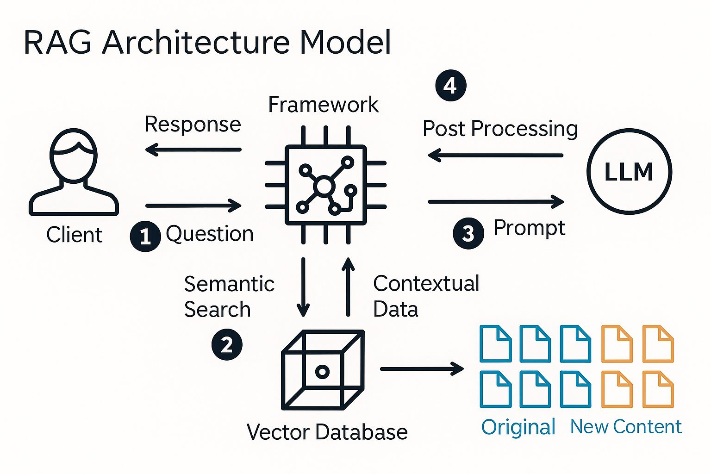

# 🔐 Sistema RAG CAPEC - Implementação TypeScript

Este projeto implementa o equivalente TypeScript do código Python para sistema RAG (Retrieval-Augmented Generation) usando Ollama e LanceDB, processando o arquivo `capec-stride-mapping.json` ao invés de PDFs.

## 🧭 Arquitetura RAG



Visão geral do fluxo: (1) pergunta do cliente → (2) busca semântica no banco vetorial → (3) prompt com contexto para o LLM → (4) pós-processamento e resposta.

## 🎯 Funcionalidades

- **Processamento de dados CAPEC**: Converte o arquivo JSON de mapeamento CAPEC em chunks processáveis
- **Vetorização com Ollama**: Usa embeddings do Ollama para criar representações vetoriais
- **Banco vetorial LanceDB**: Armazena e consulta embeddings
- **Chat interativo**: Interface para perguntas sobre ataques de segurança

## 🛠️ Tecnologias Utilizadas

- **TypeScript** - Linguagem principal
- **LangChain** - Framework para construção de fluxos de IA
- **Ollama** - LLM local (Mistral) para embeddings e geração
- **LanceDB** - Banco de dados vetorial
- **Node.js** - Runtime JavaScript

## 📋 Pré-requisitos

- Node.js 18+ instalado
- Ollama rodando com modelo Mistral
- Arquivo `capec-stride-mapping.json` (já incluído no projeto)

## 🚀 Instalação e Configuração

### 1. **Instalar dependências:**
```bash
npm install
```

### 2. **Configurar Ollama:**
```bash
# Verificar se Ollama está rodando
curl http://192.168.1.57:11434/v1/models

# Se necessário, instalar Mistral
ollama pull mistral:latest
```

### 3. **Criar banco de dados:**
```bash
OLLAMA_BASE_URL=http://192.168.1.57:11434 npm run create-db
```

### 4. **Usar o chat:**
```bash
OLLAMA_BASE_URL=http://192.168.1.57:11434 npm run chat
```

## 🔧 Scripts Disponíveis

```bash
npm run create-db          # Cria o banco vetorial com embeddings
npm run chat               # Inicia o chat interativo
npm run test-ollama        # Testa conexão com Ollama
npm run build              # Compila TypeScript
```

## 🏗️ Estrutura do Projeto

```
.
├── data/
│   └── capec-stride-mapping.md        # Base CAPEC em markdown
├── docs/
│   └── rag-architecture-model.png     # Imagem da arquitetura (adicione aqui)
├── public/
│   └── index.html                     # UI web estática
├── src/
│   ├── services/
│   │   └── qaService.ts               # Q&A compartilhado (RAG + filtro STRIDE)
│   ├── types/
│   │   └── index.ts                   # Tipos TypeScript
│   ├── utils/
│   │   └── documentProcessor.ts       # Processador e chunker de documentos
│   ├── chat.ts                        # CLI do chat
│   ├── createDatabase.ts              # Criação/população do LanceDB
│   ├── server.ts                      # Servidor Express (API / UI)
│   └── testOllama.ts                  # Teste de conectividade com Ollama
├── lancedb/                           # Dados LanceDB (gerado em runtime)
├── env.example                        # Exemplo de configuração
├── package.json                       # Scripts e dependências
├── README.md                          # Este guia
├── SETUP.md                           # Passo a passo detalhado
└── tsconfig.json                      # Configuração TypeScript
```

## 💬 Como Usar

### **1. Criar o banco de dados:**
```bash
OLLAMA_BASE_URL=http://192.168.1.57:11434 npm run create-db
```

Este comando irá:
- Ler o arquivo `capec-stride-mapping.json`
- Processar todos os ataques e categorias
- Gerar embeddings usando Ollama
- Armazenar no LanceDB

### **2. Usar o chat:**
```bash
OLLAMA_BASE_URL=http://192.168.1.57:11434 npm run chat
```

### **Exemplos de perguntas:**
```
Escreva sua pergunta: O que é Information Disclosure?
Escreva sua pergunta: Como funcionam ataques de sniffing?
Escreva sua pergunta: Quais são os ataques CAPEC-129?
Escreva sua pergunta: Me explique sobre ataques de eavesdropping
```

## 📊 Estatísticas do Processamento

O sistema processa:
- **606 chunks** do arquivo CAPEC
- **10 categorias** principais
- **596 ataques** específicos
- **Metadados** completos com links e hierarquias

## 🔒 Segurança

- **Processamento local** - Dados não saem da sua infraestrutura
- **Ollama local** - Sem dependência de APIs externas
- **LanceDB local** - Controle total sobre os dados

## 🚀 Próximos Passos

1. **Configure o Ollama** com o modelo Mistral
2. **Execute** `npm run create-db` para criar o banco
3. **Use** `npm run chat` para fazer perguntas
4. **Explore** diferentes tipos de ataques e categorias

---

**🔐 Implementação TypeScript do código Python original com Ollama e LanceDB** 
